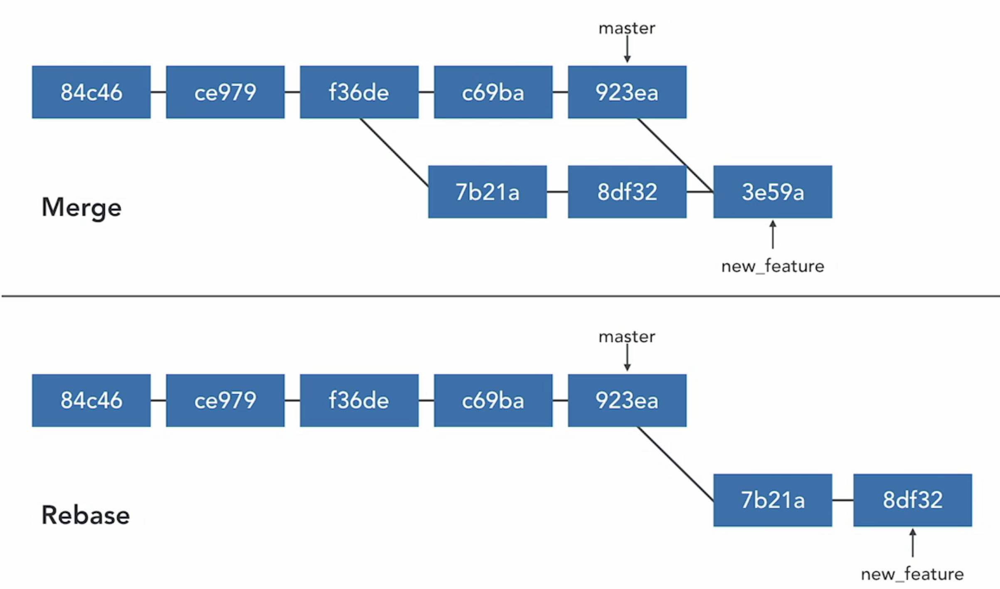

## Rebase
- Take commits from a branch and replay htem at the end of another branch.

- Usefult to intergrate recent commits without merging

- Maintains a cleaner, readable, more linear project history, easier for use to track down 


## prepare for rebase
return commit where topic brach diverges
```
  git merge-base master new_feature

  git log --graph --all --oneline --decorate   
```

## rebase
rebase current branch to tip of master
```
  git reabase master
```

rebase new_feature branch to tip of master
```
  git reabase master new_feature
```

rebase onto other branch
```
  git rebase --onto newbase upstream branch
```


## merge vs rebase

Merging
- easy to undo
- add a merge commit
- complete record of what happened and when

Rebase
- No additional merge commit
- Destructive: SHA changes, commits are rewritten
- No longer a complete record of what happened and when
- Trick to undo
- Logs are cleaner, more linear

Rules
- Do NOT reabase a public branch
reabase abandons existing, shared commits and creates a new similar cmmits instead

- Merge to bring large topic branches back into master

- Rebase to move commits from one branch to another

## Confilicts
```
  git regase --continue

  git rebase --skip

  git rebase --abort
```

